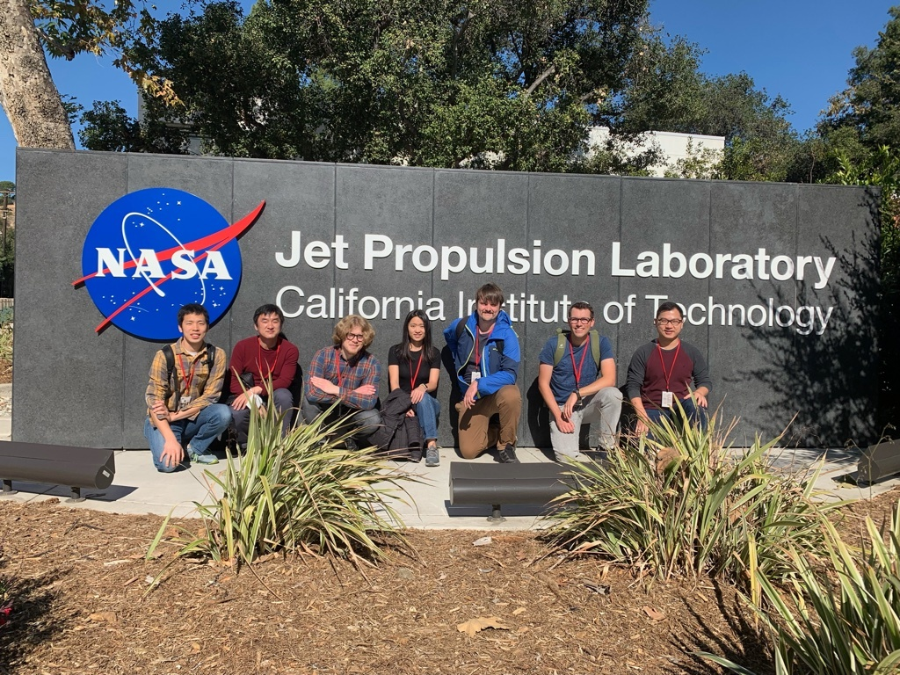

# Space geodesy · Lithospheric deformation

*   *   *

## About me
I am a postdoctoral researcher at Department of Geophysics, Doerr School of Sustainability, Stanford University.

I am a geophysicist interested in how lithospheric processes and medium properties manifest as observable crustal deformation. My research integrates high-resolution spaceborne geodesy (primarily **InSAR** and **GNSS**) with seismological data to resolve the deformation continuum across diverse scales. I am interested in inverse problems that use optimization or stochastic sampling methods to infer the kinematics of faults, volcanoes, and plate rotations through analytical formulations and Boundary Element Modeling.

**Research Interests:**
tectonic geodesy, InSAR, seismic cycles, plate tectonics, statistical seismology.

## News

[06/2026] Will be at the [2026 Crustal Deformation Modeling Workshop](https://geodynamics.org/events/details/372), Golden, CO.

[03/2026] Presented my [recent work in Peru-Chile subduction zone](/research/#chile-insar) at the [SZ4D conference](https://www.sz4d.org/events/2026-sz4d-science-community-meeting) at Long Beach, CA.

[01/2026] I start my postdoc at **Geophysics, Stanford**, working with Prof. [Howard Zebker](https://ee.stanford.edu/~zebker/index.html) to advance on open-access ground displacement products for volcano monitoring globally using Sentinel-1 and NISAR data. I am also working to Prof. [Rosemary Knight](https://sustainability.stanford.edu/people/rosemary-knight) to explore the capability of InSAR in our understanding of surface and subsurface hydrological processes.

[12/2025] I will be at the Subduction zone deformation session at AGU, New Orleans.

--

[10/2025] *I have defended my Ph.D. dissertation from the [Caltech Seismolab](https://www.seismolab.caltech.edu), under the mentorship of Profs. [Mark Simons](http://web.gps.caltech.edu/~simons/) and [Zach Ross](http://web.gps.caltech.edu/~zross/). Check out [my thesis](https://thesis.caltech.edu/17795/).*

## Education

+ Ph.D., Geophysics, California Institute of Technology, 2019--2025
  + Thesis: Space Geodetic Constraints on Plate Motion, Fault Creep, and Megathrust Coupling
  + Advisor: Mark Simons, Zach Ross

+ Ph.D. Minor, Computational Science, California Institute of Technology, 2021--2025
+ M.S., Earth Science and Engineering, KAUST, Saudi Arabia, 2016--2018
  + Thesis: Ground Deformation Related to Caldera Collapse and Ring-Fault Activity
  + Advisor: Sigurjón Jónsson
+ B.S., Geology & B.Eng., Civil Engineering, National Taiwan University, 2010--2015

## Experience

* **01/2026--present:** Postdoc, Geophysics, Stanford University
* **08/2019--10/2025:** Graduate researcher, Caltech Seismological Laboratory
* **08/2016--07/2018:** Master researcher, Crustal deformation & InSAR group, King Abdullah University of Science and Technology (KAUST, Saudi Arabia)
* 2015: Research assistant, Institute of Earth Sciences, Academia Sinica, Taipei, Taiwan

---

{:style="width: 70%;"}
> Peak era of Simons' group members in front of JPL, 2022. Left to right are me, Lijun Zhu, Leonid Pereiaslov, Yujie Zheng, Alex Berne, Tobias Köhne, Yunjun Zhang. Hmmm, where were Ollie, Rishav, and Théa?