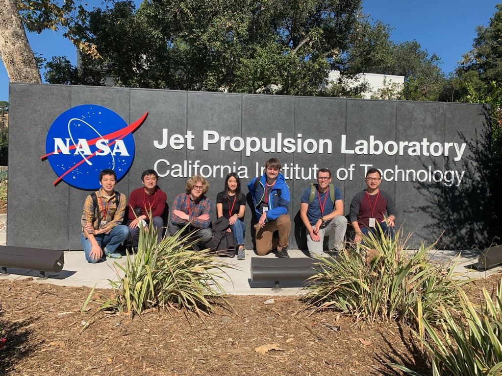

# About Me

*   *   *

Hi! Welcome to my page. I am a graduate student at [Caltech Seismolab](https://www.seismolab.caltech.edu) working under the mentorship of [Mark Simons](http://web.gps.caltech.edu/~simons/) and [Zach Ross](http://web.gps.caltech.edu/~zross/). My research incorporates space geodesy and statistical methods on seismicity to understand geophysical processes associated with seismic cycles, aseismic deformation, and tectonic processes. In the past, I also work with [Sigurjón Jónsson](https://cdi.kaust.edu.sa/people/detail/sigurj%C3%B3n-j%C3%B3nsson) in KAUST on the crustal deformation of caldera collapses.

My [Google Scholar profile](https://scholar.google.com/citations?authuser=1&user=YCCuojgAAAAJ).

My [GitHub page](https://github.com/yuankailiu).

## Education

*   *   *

+ California Institute of Technology, CA, USA (2019–): Ph.D. candidate, Geophysics
+ King Abdullah University of Science and Technology, Saudi Arabia (2016–2018): M.S. in Earth Science and Engineering
+ National Taiwan University, Taiwan (2010–2015): B.S. in Geology; B.S. in Civil Engineering

## Experience

*   *   *

+ Caltech Seismological Laboratory (Summer 2019–): Graduate student researcher

+ King Abdullah University of Science and Technology, Crustal deformation & InSAR group (2016–2018): Graduate researcher

+ Institute of Earth Sciences, Academia Sinica, Taipei, Taiwan (2015): Research assistant

+ Institute of Earth Sciences, Academia Sinica, Taipei, Taiwan (2012): Summer intern

## Feel free to contact me

*   *   *

+   Email: <ykliu@caltech.edu>

+   Twitter: <https://twitter.com/yuan_kai_liu>

+   ORCID ID: <https://orcid.org/0000-0003-4032-9444>

+   ResearchGate: <https://www.researchgate.net/profile/Yuan-Kai-Liu>

{:class="img-responsive"}

> Mark Simons' group members in front of JPL, 2022
