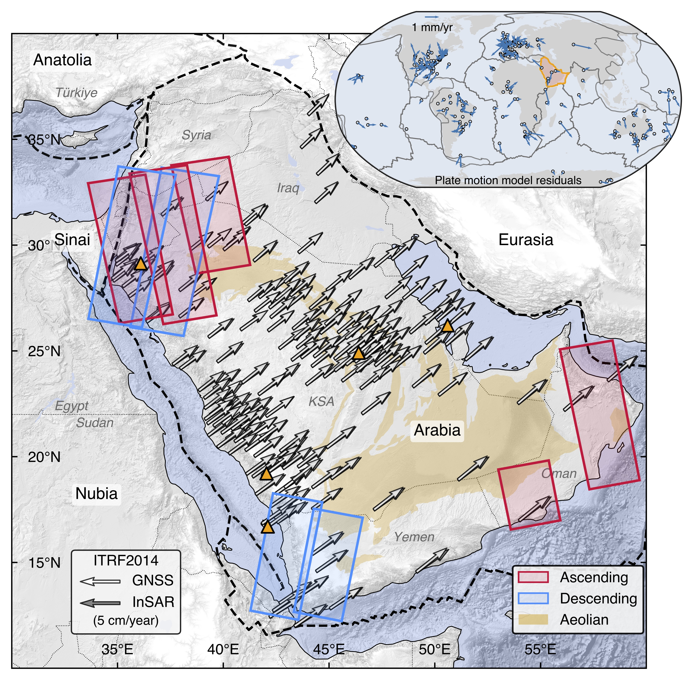
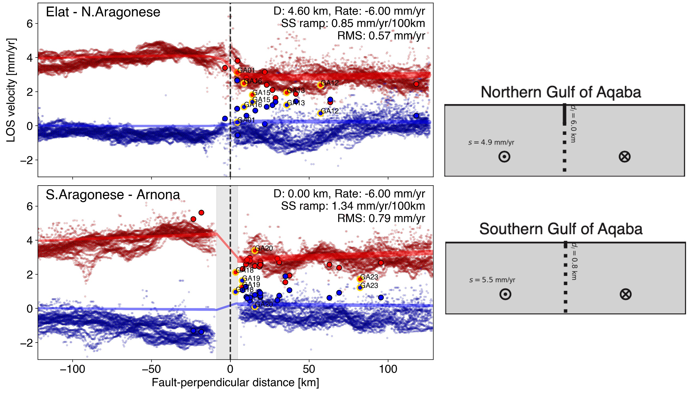
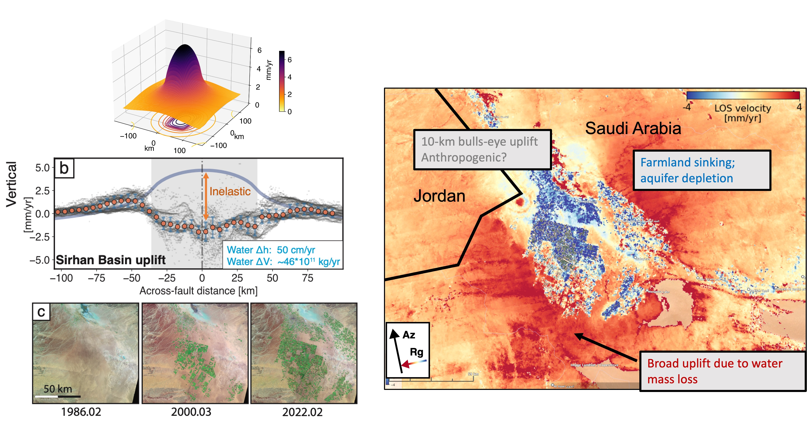
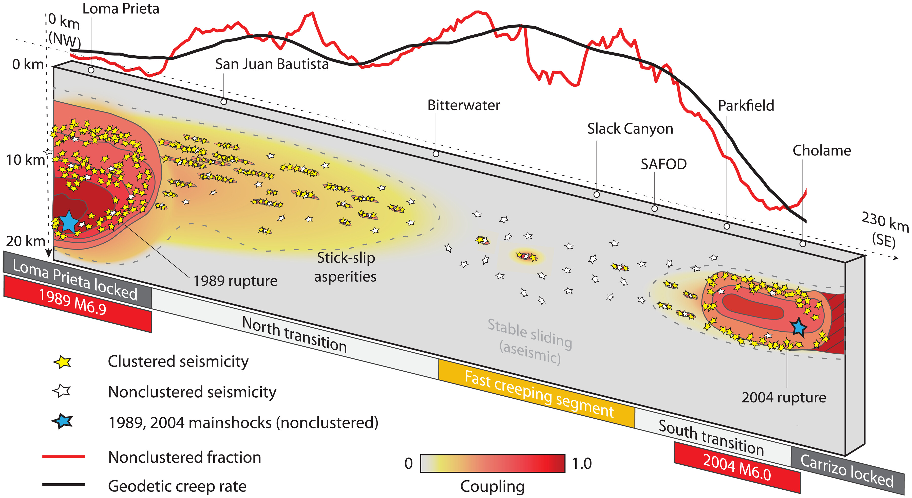
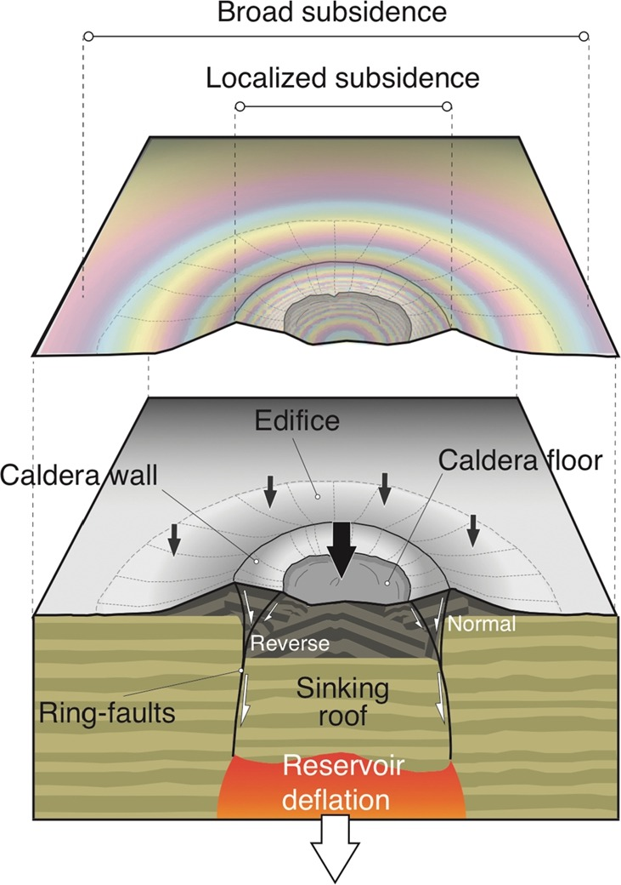

# Research topics

*   *   *

> Seismic cycles, geodesy, interferometric synthetic aperture radar, crustal deformation, earthquake statistics

#### Inferring absolute plate rotation at GNSS-sparse region, using InSAR secular velocities

{:style="width: 90%; height: auto;"}

Plate motion models provide critical input to understanding lithospheric kinematics and strain accumulation along boundary zones. From large tectonic plates to regional tectonic blocks, these models are commonly determined using velocities from Global Navigation Satellite System (GNSS) stations. But what do we do at places with only sparse distribution of permanent GNSS stations in the plate interiors?

[In this manuscript]() (to be submitted), we use the spatial gradients of line-of-sight velocity fields over the Arabian Peninsula to constrain a common rigid rotation pole in a global reference frame. We correct for long-wavelength effects from troposphere, ionosphere, solid and ocean tides, etc. We account for both observational and theory errors in our inverse model. We also discuss limitations of current satellite geometries in Euler pole inference.

This work extends the concept of inferring an internal reference frame to InSAR and highlights the potential of integrating InSAR with conventional networks for high-resolution plate motion models, especially in remote areas.

#### Interseismic coupling along Dead Sea Transform - Gulf of Aqaba (in prep.)

{:style="width: 100%; height: auto;"}

The Gulf of Aqaba is the most seismically active region between Egypt and Saudi Arabia. The gulf hosts dense seismicity near the bathymetric-mapped fault structures. Several large earthquakes and prolific swarms were recorded in the past, including the [1995 M 7.3 Nuweiba Earthquake](https://www.ipgp.fr/~klinger/web_Yann/papiers/klinger_GRL2000.pdf). One key question to answer is whether the southern Dead Sea fault is creep. This will help to understand the fault shallow slip deficit, strain accumulation, and the associated seismic hazard on the new megacity, [NEOM](https://www.neom.com/en-us).

Previous GPS block model predicts left-lateral and opening motion along central and southern Dead Sea fault. But most of past measurements are based on sparse ground measurements from mostly campaign GPS, and limited burst-overlap interferometry. We try to deconvolve the secular current deformation features in these segments from spatialtemporally dense Sentinel-1 measurements.

#### Crustal rebound induced by aquifer unloading (in prep.)

{:style="width: 100%; height: auto;"}

Water usage from the subsurface aquifers modulates the surface deformation. A decade of InSAR on ground movement in the [Sirhan Basin](https://earthobservatory.nasa.gov/images/77900/crop-circles-in-the-desert) (Saudi Arabia-Jordan border) may show a similar to [studies in the Los Angeles Basin](https://www.caltech.edu/about/news/animation-based-satellite-data-shows-socal-breathing-water-83080), Southern California. This pattern shows a trend of uplift, which we want to understand better. We want understand how much the deformation is elastic and how much is inelastic. This work is crucial for understanding the impact of groundwater management in the region and ensuring sustainable use of these vital resources.

#### Dynamics of seismicicty

{:class="img-responsive"}

Continental faults are paved with locked interfaces interleaved by sections that slip aseismically. The kinematics, derived from geodesy such as GPS and InSAR, often show a transitioning between fully-locked and fully-creeping sections. But since fault slips trigger earthquakes, can the earthuqake statistics tell us something about the fault behaviors?

[This study](https://www.science.org/doi/full/10.1126/sciadv.abk1167), we find that in the central San Andreas Fault, the relative population of background earthquakes, those who do not exhibit temporal clustering, can serve as a proxy of fault coupling. Under this paradigm, the stronger fault coupling results in strong temporal clustering of seismicity, while lower fault coupling manifests in weaker temporal clustering, with repeating earthquakes as an end-member.

#### Crustal deformation of caldera collapse

{:style="width: 80%; height: auto;"}

Caldera is a complicated volcanic system with magmatic chambers, dikes, boundary faults, etc. Crustal deformation of subsiding calderas can be complex, too. Deformations from the [Wolf Caldera in Galápagos](https://agupubs.onlinelibrary.wiley.com/doi/full/10.1002/2016GL069820) and the Axial seamount in the Pacific Ocean show a pattern composed of a broad deflation across the entire volcanic edifice and of a time-dependent localized subsidence signal focused within the caldera. 

[In this study](https://www.sciencedirect.com/science/article/pii/S0012821X19304765?via%3Dihub), we use analog sandbox experiments and boundary element modeling to reproduce this geodetic observation (e.g., from InSAR). In a piston-like caldera collapse system, the development of ring faults localizes the subsidence progressively as it propagates toward ground surface. Hence, overlooking the ring-fault activity in a collapse process can lead to inappropriate model choices (vertically stacking magmatic presure sources), and the incorrect estimations of the volume changes of magma reservoir.

